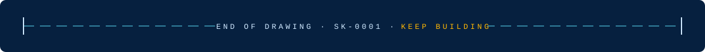

  

  

<h3 align="center">◤ BILL OF MATERIALS ◢</h3>

<table align="center">
  <tr>
    <th>🖥️ CODE</th>
    <th>🔌 ELECTRONICS</th>
    <th>🛠️ FABRICATION</th>
  </tr>
  <tr>
    <td align="center"></td>
    <td align="center"></td>
    <td align="center"></td>
  </tr>
</table>

<h3 align="center">◤ LIVE TELEMETRY ◢</h3>

  

  

  

<!--
  Hand-made art: edit scripts/build_art.py, then run `python3 scripts/build_art.py`.
  Stats + snake are rebuilt every 6 hours by .github/workflows/profile.yml.
-->
